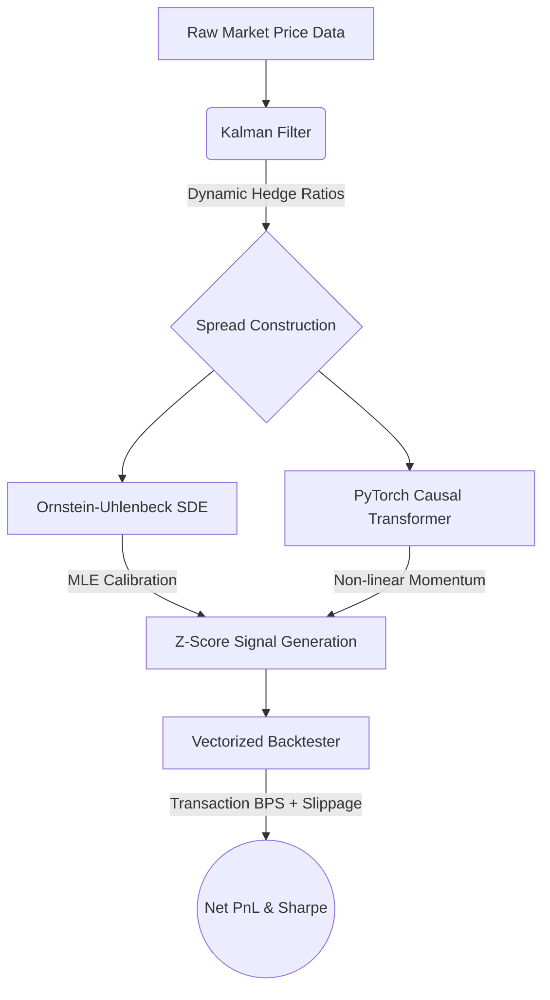

<div align="center">
  <h1>📈 StatArbEngine</h1>
  <h3>Quantitative Pairs Trading Infrastructure</h3>
  <p><i>State-Space Kalman Filters, Stochastic Modeling, and Autoregressive Transformers</i></p>
  
  
  
</div>

<br>

An institutional-grade Statistical Arbitrage (StatArb) trading engine that replaces traditional static OLS regressions with a **dynamic State-Space Kalman Filter** and an **autoregressive PyTorch Causal Transformer**.

## 🧠 System Architecture



## 📐 Mathematical Framework

### 1. Dynamic Hedging via Kalman Filter
Traditional pairs trading relies on rolling Ordinary Least Squares (OLS), which incorrectly assumes a static hedge ratio. `StatArbEngine` implements a custom NumPy vectorized Kalman Filter to recursively track the unobservable hidden state (the dynamic hedge ratio) amidst market microstructure noise.
*   **Process Noise ($Q$)**: Calibrated to allow the hedge ratio to drift smoothly alongside macroeconomic changes.
*   **Measurement Noise ($R$)**: Calibrated to filter out high-frequency bid-ask bounce.

### 2. Stochastic Modeling (Ornstein-Uhlenbeck)
The resulting spread is modeled continuously as a mean-reverting Ornstein-Uhlenbeck (OU) stochastic differential equation:

```math
dX_t = \theta (\mu - X_t)dt + \sigma dW_t
```

*   $\theta$: Speed of mean reversion (determines our holding period).
*   $\sigma dW_t$: The stochastic Wiener process (Brownian motion).
*   **Maximum Likelihood Estimation (MLE)** is used to calibrate these parameters dynamically directly from the filtered spread. 

### 3. PyTorch Causal Transformer
To capture short-term anomalies before the OU mean-reversion forces take over, a custom Self-Attention mechanism is deployed.
*   **Architecture**: Causal masking ensures zero look-ahead bias.
*   **Objective**: Predict the $t+1$ directional momentum of the spread.

## 📉 Realistic Vectorized Backtesting (Friction Engine)
Academic backtests look great until execution friction destroys the PnL. This engine penalizes the theoretical OU signals using a highly realistic execution environment:
*   **Transaction Costs**: Dynamic basis points (bps) commissions applied to every lot traded.
*   **Bid-Ask Slippage**: Volume-weighted slippage penalties.
*   **Vectorization**: Pure Pandas/NumPy execution ensuring zero `for`-loop bottlenecks across 100,000+ data points.

## 🚀 Local Execution
Launch the interactive dashboard to simulate the engine:

```bash
pip install -r requirements.txt
streamlit run app.py
```

---
*Disclaimer: This infrastructure is for research and portfolio demonstration purposes only. It is not financial advice.*
